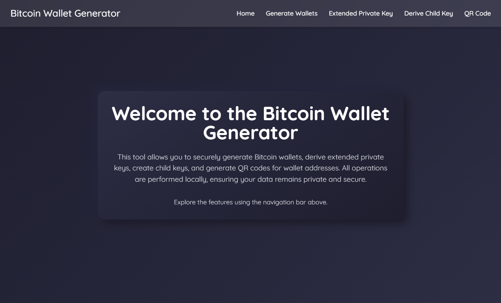

# Bitcoin Wallet Generator

This project provides a **Bitcoin Wallet Generator** for creating wallets, deriving extended private keys, generating child keys, and producing QR codes for wallet addresses. The application includes both a command-line interface (CLI) and a web-based interface built using **Axum** and **TailwindCSS**.

---

## Features and Objectives

1. **Wallet Management**
   - Generate Bitcoin wallets with private keys, public keys, and addresses.
   - Create QR codes for wallet addresses for easy sharing.

2. **Key Derivation**
   - Derive extended private keys using a secure HMAC-SHA512 mechanism.
   - Generate child keys using the BIP32 hierarchical deterministic (HD) wallet standard.

3. **Web Interface**
   - Interact with the wallet generator using a modern, responsive web interface.
   - Generate wallets, derive keys, and create QR codes directly from your browser.

4. **Data Persistence**
   - Save generated wallets, private keys, and QR codes in structured JSON files for easy reference.

---

## Screenshot



---

## Prerequisites

1. **Rust**
   Install Rust by following the [official installation guide](https://www.rust-lang.org/tools/install).

2. **Git**
   Install Git to clone the repository: [Git Installation Guide](https://git-scm.com/).

---

## Project Structure

- **`src/`**: Contains all the Rust modules for wallet generation, key derivation, and web interface.
  - `bip32.rs`: Implements the BIP32 standard for HD wallets.
  - `bip39.rs`: Implements mnemonic phrase generation for wallet recovery.
  - `wallet.rs`: Contains core wallet functionalities such as address generation.
  - `web.rs`: Defines the Axum-based web server for the project.
- **`Cargo.toml`**: The Rust project manifest defining dependencies and metadata.
- **`data/`**: Stores generated wallets, extended keys, child keys, and QR codes in organized directories.
- **`README.md`**: This file, providing an overview of the project.

---

## Setting Up the Project

### 1. Clone the Repository

```bash
git clone https://github.com/KyllianGenot/Bitcoin-Wallet-Generator.git
cd Bitcoin-Wallet-Generator
```

---

### 2. Install Dependencies

Use Cargo, the Rust package manager, to install project dependencies:

```bash
cargo build
```

---

### 3. Run the CLI Application

Run the CLI to interact with the wallet generator (choose option 5 to use it on the web interface):

```bash
cargo run
```

---

### 4. Run the Tests

To verify the correctness of the implementation, you can execute the project's test suite using:

```bash
cargo test
```

This will run all unit tests defined in the project to ensure the wallet generation, key derivation, and other features work as expected.

---

## How It Works

### 1. **Wallet Generation**
   - Generate a wallet with a mnemonic phrase and display the private key, public key, and address.

### 2. **Key Derivation**
   - Derive an extended private key using a secure seed.
   - Generate child keys based on the BIP32 standard.

### 3. **QR Code Generation**
   - Create and save QR codes for wallet addresses in SVG format.

### 4. **Web Interface**
   - Use the Axum-based web server for wallet management via an intuitive web UI.

---

## License

This project is licensed under the MIT License.

---

By following this guide, you can generate Bitcoin wallets, derive keys, and manage wallet data both locally and via the web interface. For any issues or suggestions, feel free to open an issue in the repository.
